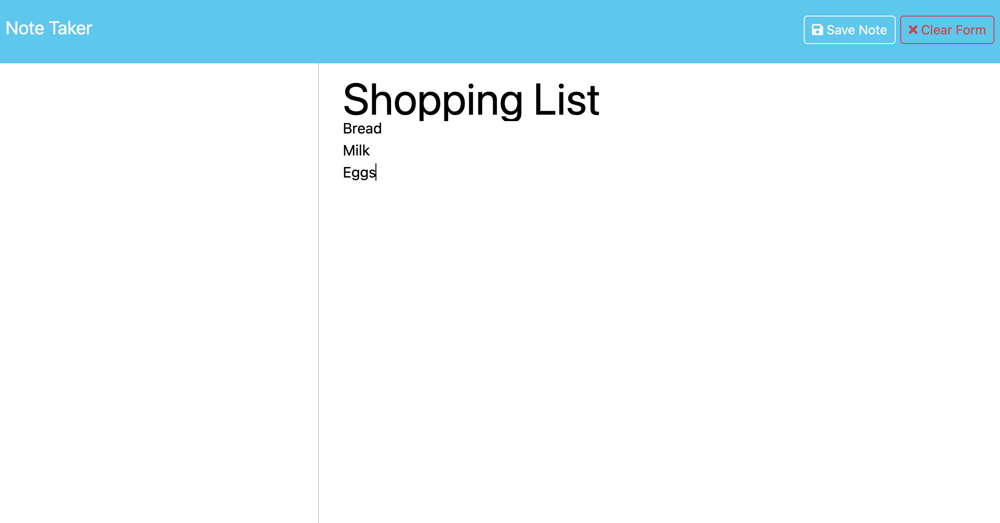

# Note Taker

[Visit Deployed Site](https://abenedetti27.github.io/password-generator/)

[](https://opensource.org/licenses/MIT)

## Description <a name="description"></a>

This is an app to write and save notes to organize thoughts and keep track of tasks to be completed.

## Table of Countents 
- [Description](#description)
- [Installation](#installation)
- [Usage](#usage)
- [License](#license)
- [Questions](#questions)

## Installation <a name="installation"></a>
When the user opens the Note Taker, they are presented with a landing page with a link to a notes page. After they click on the link to the notes page they are presented with a page with existing notes listed in the left-hand column, plus empty fields to enter a new note title and the note’s text in the right-hand column

When the user enters a new note title and the note’s text they can see a "Save Note" button and a "Clear Form" button in the navigation at the top of the page. After clicking on the Save button, a new note they have entered is saved and appears in the left-hand column with the other existing notes and the buttons in the navigation disappear.

When the user clicks on an existing note in the list in the left-hand column that note appears in the right-hand column and a "New Note" button appears in the navigation. When the user clicks on the "New Note" button in the navigation at the top of the page
they are presented with empty fields to enter a new note title and the note’s text in the right-hand column and the button disappears.


![Screenshot of New Note]


```
var generateBtn = document.querySelector("#generate");

// Write password to the #password input
function writePassword() {
  function generatePassword() {
    const lowerCase = "abcdefghijklmnopqrstuvwxyz";
    const upperCase = "ABCDEFGHIJKLMNOPQRSTUVWXYZ";
    const numbers = "0123456789";
    const symbols = "!@#$%^&*()_+~`|}{[]:;?><,./-=";

    let passwordLength;

    // Prompt for password length until a valid input is received
    do {
      passwordLength = parseInt(prompt("Enter password length (between 8 and 128 characters)"));

      if (isNaN(passwordLength) || passwordLength < 8 || passwordLength > 128) {
        alert("Please enter a valid password length between 8 and 128 characters.");
      }
    } while (isNaN(passwordLength) || passwordLength < 8 || passwordLength > 128);

    let includeLowerCase, includeUpperCase, includeNumbers, includeSymbols;

    // Prompt for character types until at least one type is selected
    do {
      includeLowerCase = confirm("Include lowercase characters?");
      includeUpperCase = confirm("Include uppercase characters?");
      includeNumbers = confirm("Include numbers?");
      includeSymbols = confirm("Include symbols?");

      if (!(includeLowerCase || includeUpperCase || includeNumbers || includeSymbols)) {
        alert("Please select at least one character type.");
      }
    } while (!(includeLowerCase || includeUpperCase || includeNumbers || includeSymbols));


```

## Usage <a name="usage"></a>
This is a deployed application to write and save notes to organize thoughts and keep track of tasks to be completed.


## License <a name="license"></a>
MIT License


## Questions <a name="questions"></a>

GitHub Profile: [github](https://github.com/abenedetti27)

Please direct any questions to:

Email: abenedetti27@gmail.com
